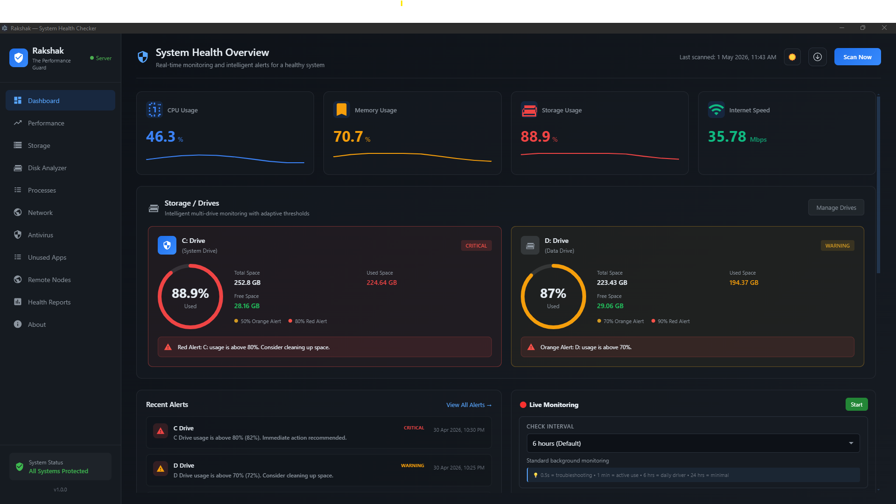
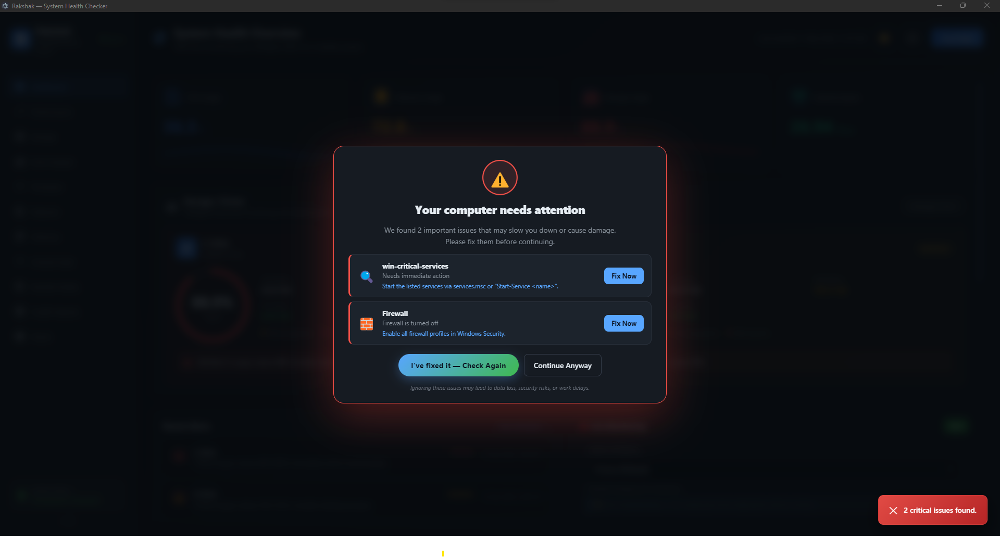
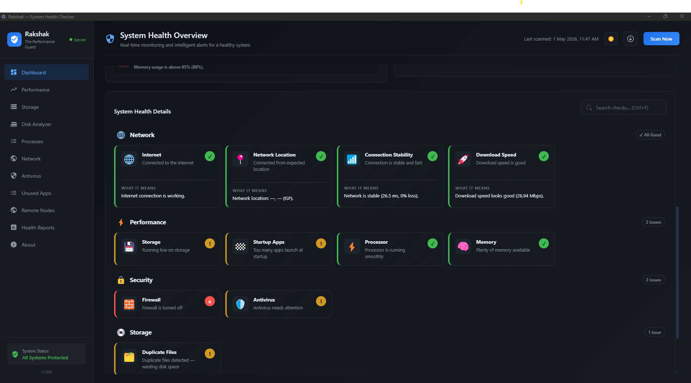
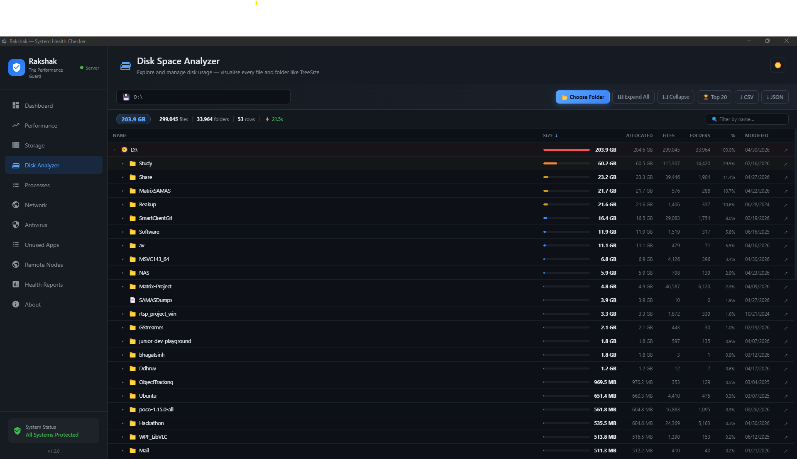
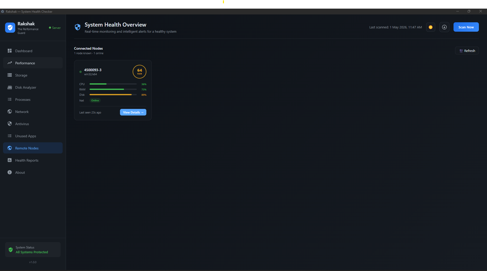
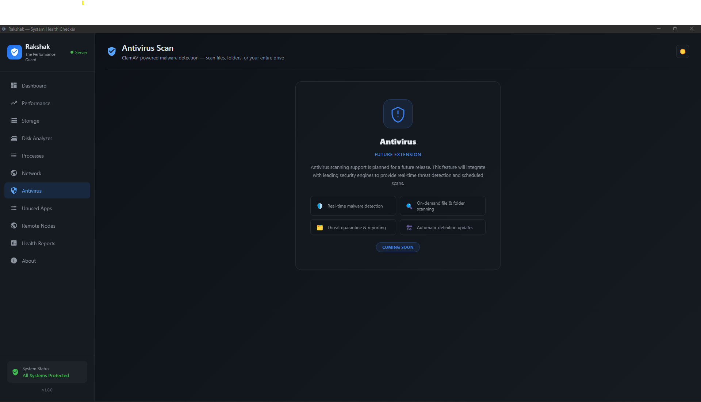

# Rakshak — Developer Machine Health Guardian

> **रक्षक** (Sanskrit) = *Protector*

**Rakshak** is a cross-platform developer machine health platform that proactively monitors, scores, and enforces the health of every engineer's workstation — before a bad machine turns into a missed deadline, a failed build, or a compliance incident.

---

## Table of Contents

1. [Project Overview](#1-project-overview)
2. [Business Perspective](#2-business-perspective)
3. [Key Features](#3-key-features)
4. [System Architecture](#4-system-architecture-high-level)
5. [Workflow / Code Flow](#5-workflow--code-flow-conceptual)
6. [Business Flow Diagram](#6-business-flow-diagram)
7. [Screenshots](#7-screenshots)
8. [Deployment Overview](#8-deployment-overview)
9. [Future Scope](#9-future-scope)
10. [Glossary](#10-glossary)

---

## 1. Project Overview

### Project Name
**Rakshak** — Developer Machine Health Guardian

### Problem Statement

Engineering organisations silently lose thousands of hours each month to **broken developer machines**:

- Disks at 99% cause silent build failures and IDE hangs
- Disabled antivirus or firewalls trigger compliance audit failures
- Slow or unstable Wi-Fi wastes 30+ minutes per engineer daily
- Developers working from cafés without VPN get blocked by IP allow-lists, generating support tickets
- Unpatched operating systems expose the org to CVEs discovered only *after* an incident
- 30+ startup applications make laptops take 8+ minutes to be usable in the morning

Today, these problems are "solved" by slow IT tickets, admin-only MDM dashboards, and tribal knowledge. **There is no tool that tells a developer, in real time, "your machine is not ready for work today — here is why, and here is the one-click fix."** Rakshak is that tool.

### Target Users / Customers

| Audience | How Rakshak Helps |
|---|---|
| **Individual Developers** | Instant visibility into what is hurting their machine and productivity |
| **Engineering Leads** | Confidence that the whole team's machines are in a known-good state |
| **IT / DevOps Teams** | Fleet-wide health dashboard, proactive alerting, helpdesk ticket deflection |
| **CTOs / VPs Engineering** | Compliance evidence, reduced toil, quantified productivity gains |
| **Regulated Industries** | SOC 2, ISO 27001, HIPAA-aligned automated health checks and audit logs |

### Key Value Proposition

Rakshak is the **only tool that sits at the intersection of developer experience, IT compliance, and actionable UX** — giving developers a friendly, real-time health score and giving IT teams a fleet-wide monitoring dashboard, all from a single lightweight desktop agent.

---

## 2. Business Perspective

### Why This Project Exists

MDM platforms (Intune, Jamf) are designed for IT administrators — developers never see them and get no actionable feedback. Generic system utilities (CCleaner, Speccy) have no concept of developer workflows. Security tools (CrowdStrike, SentinelOne) focus on threats, not productivity. The result is a gap that costs engineering organisations real money every month.

Rakshak closes that gap.

### Business Use Cases

1. **New-hire onboarding** — A new engineer's machine is auto-audited on Day 1 for disk space, antivirus, VPN, Git identity, and Docker. IT sees a green/red dashboard instead of 40 first-day support tickets.
2. **Pre-meeting health checks** — Run Rakshak before a standup or client call; if Wi-Fi quality is poor, the developer knows *before* they disrupt the meeting.
3. **Compliance evidence collection** — Per-machine health snapshots are automatically collected and exportable as audit logs for SOC 2 / ISO 27001 control evidence.
4. **Helpdesk deflection** — Approximately 30 % of Level-1 IT tickets ("my machine is slow", "VPN won't connect", "build failed") are pre-empted by Rakshak's actionable, self-serve suggestions.
5. **Asset hygiene & refresh planning** — IT proactively sees machines with chronic disk, RAM, or antivirus issues and plans hardware refresh cycles accordingly.
6. **Remote / contractor verification** — Verifies that a contractor's machine meets client security policy *before* VPN access is granted.

### Quantified Impact (Conservative, per 100 Engineers)

| Impact Area | Monthly Saving |
|---|---|
| 10 min/day saved per engineer on network / disk / build env | ~415 engineer-hours |
| 30 % fewer Level-1 IT tickets | ~$4,000–$6,000 at typical MSP rates |
| Compliance audit prep time | Weeks reduced to hours |

### Industry Relevance

Rakshak is immediately relevant to any organisation where developers are the primary workforce — software product companies, fintech, healthtech, e-commerce, outsourcing agencies, and any enterprise running a DevOps or platform engineering function.

### Benefits for Stakeholders

- **Developers** — Less time fighting their own machine, more time shipping features
- **IT Admins** — Proactive fleet visibility without a single support ticket
- **Engineering Managers** — Reduced risk of outages caused by a single broken laptop
- **Security / Compliance Teams** — Continuous, automated evidence that machines meet policy
- **Finance / Operations** — Measurable ROI through reduced IT spend and engineer downtime

---

## 3. Key Features

### Health Score Engine
Every machine receives a live **health score from 0–100 %**, computed across all active checks. The score is colour-coded (green / amber / red) and displayed as an animated ring, giving developers an immediate, glanceable signal of their machine's state.

### Critical Gate (Blocking Enforcement)
When a check identifies a condition that would damage productivity or violate security policy — such as antivirus disabled, disk full, or no network — Rakshak displays a **full-screen blocking dialog**. The user must fix the issue or explicitly acknowledge the risk. Unlike a dismissible tray notification, the Critical Gate ensures critical issues are not ignored.

### Plugin-Based Check Architecture
Every health check is a single self-contained file dropped into the `/checks` folder. Teams can add their own checks (e.g. "VPN connected to corp-east", "kubectl context is not prod") with zero changes to the core engine. Checks run in parallel and time out safely.

### Cross-Platform Support (Windows & Linux)
All checks run natively on both Windows and Linux. OS-specific checks (Windows Defender, Windows Firewall, systemd services, Linux firewall) are automatically included or excluded based on the detected platform.

### Developer-Aware Checks
Beyond generic system metrics, Rakshak understands developer workflows. It checks Git configuration, Docker daemon status, VPN connectivity and ASN verification, outbound network speed, antivirus scan status, and startup application bloat — all items that directly affect engineering productivity.

### Live Alerts & Notifications
Rakshak watches key metrics continuously in the background. When health drops below a configurable threshold, a native desktop notification is triggered. Alerts are displayed inside the app as a persistent live feed.

### Remote Fleet Dashboard (Central Monitor)
A companion server component collects health reports from every Rakshak agent in the organisation over an encrypted gRPC connection. IT teams access a web-based dashboard showing every node's health score, CPU, memory, disk, connectivity, and issue list — all in real time.

### Export & Audit Logs
Health scan results can be exported for compliance reporting, providing time-stamped, machine-level evidence for security audits.

### Disk Space Analyser & Duplicate Finder
A built-in visual disk analyser identifies the largest folders and files consuming storage, and a duplicate-file scanner locates redundant copies that can be safely removed — directly addressing one of the most common developer productivity drains.

### Unused Application Detection
Rakshak identifies applications installed on the machine that have not been launched recently, helping developers and IT teams clean up software bloat that slows startup times and consumes resources.

---

## 4. System Architecture (High-Level)

Rakshak has two independently deployable components that work together:

### Component 1 — Desktop Agent (Rakshak App)
The developer-facing desktop application, installed on each developer's machine. It runs checks, displays the health score, and enforces the Critical Gate. It also streams health reports to the central server when configured.

### Component 2 — Central Health Monitor (Rakshak Server)
A lightweight server deployed on the organisation's infrastructure. It receives health streams from all desktop agents via gRPC, aggregates the data, and serves a web-based IT dashboard over HTTP.

### High-Level Component Map

```
┌─────────────────────────────────────────────────────────┐
│                  Developer's Machine                    │
│                                                         │
│  ┌──────────────┐    ┌─────────────┐    ┌───────────┐  │
│  │  Check Plugins│───▶│ Core Engine │───▶│  React UI  │  │
│  │  (CPU, Disk,  │    │ (Score,     │    │ (Score Ring│  │
│  │  Net, AV, Git)│    │  Aggregate) │    │  Issues,   │  │
│  └──────────────┘    └──────┬──────┘    │  Gate)     │  │
│                             │           └───────────┘  │
│                      ┌──────▼──────┐                   │
│                      │  gRPC Client│                   │
│                      └──────┬──────┘                   │
└─────────────────────────────┼───────────────────────────┘
                              │ encrypted gRPC stream
                   ┌──────────▼──────────┐
                   │   Rakshak Server     │
                   │  (gRPC :50051)       │
                   │  (Web UI  :3001)     │
                   │  ┌───────────────┐  │
                   │  │  Node Registry│  │
                   │  │  Alert Engine │  │
                   │  │  Web Dashboard│  │
                   │  └───────────────┘  │
                   └─────────────────────┘
```

> **Architecture Diagram Placeholder**
> 

---

## 5. Workflow / Code Flow (Conceptual)

### How a Health Scan Works

```
1. TRIGGER
   ├── App launch (auto-scan)
   ├── User clicks "Run Scan"
   └── Scheduled interval (configurable)

2. DISCOVERY
   └── Core Engine reads all files in /checks/
       and filters to those matching the current OS

3. PARALLEL EXECUTION
   └── All applicable checks run simultaneously
       (each with a 20-second safety timeout)

4. RESULT AGGREGATION
   ├── Each check returns: status (ok/warning/critical),
   │   message, suggestion, and optional detail data
   └── Engine calculates overall health score:
       ok=100%, warning=50%, critical=0% (weighted average)

5. CRITICAL GATE EVALUATION
   └── If any check marked "blocking" returns "critical",
       the full-screen Critical Gate is shown before
       the user can access the rest of the UI

6. UI RENDER
   └── Score Ring, colour-coded issue list,
       expandable details and one-click suggestions
       are displayed to the developer

7. REPORTING (optional)
   └── Results are streamed to the Central Server
       via gRPC for fleet-wide visibility
```

> **Flow Diagram Placeholder**
> 

---

## 6. Business Flow Diagram

### Real-World Usage Flow

```
Developer opens laptop
        │
        ▼
Rakshak auto-runs on startup
        │
        ▼
  ┌─────┴──────────────────────┐
  │  Are there CRITICAL issues? │
  └─────┬──────────────────────┘
       YES                     NO
        │                       │
        ▼                       ▼
Critical Gate shown         Health Score displayed
(cannot dismiss —           (Green / Amber / Red)
 must fix or acknowledge)         │
        │                         ▼
        │               Developer reviews warnings
        │               and acts on suggestions
        ▼
   Issue resolved
        │
        ▼
Health score updated
        │
        ▼
Report streamed to Central Server
        │
        ▼
IT Dashboard updated (fleet-wide view)
        │
        ▼
Alerts triggered if threshold crossed
```

> **Business Flow Diagram Placeholder**
> 

---

## 7. Screenshots

> Add screenshots to the `docs/images/` folder and update the paths below.

### Main Dashboard — Health Score



### Critical Gate — Blocking Issue Screen



### Issue List — Warnings and Suggestions



### Disk Space Analyser



### Remote Nodes Fleet Dashboard (IT View)



### Antivirus Status Panel



---

## 8. Deployment Overview

### Desktop Agent
Rakshak is packaged as a native installer:
- **Windows** — NSIS installer (`.exe`)
- **Linux** — AppImage (no install required, portable)

The agent runs silently in the system tray after installation. It auto-launches on login in production builds and requires no configuration for standalone use.

### Central Server (Optional, for Teams and Enterprises)
The Rakshak server is a lightweight Node.js process that can be deployed:
- **On-premises** — on any server or VM inside the corporate network
- **Cloud** — on any provider (AWS, Azure, GCP) as a container or VM

Once running, agents are pointed at the server's address and begin streaming health data automatically. The web dashboard is accessible from any browser on the corporate network.

### Deployment Models

| Model | Suitable For | Components Needed |
|---|---|---|
| **Standalone** | Individual developers | Desktop agent only |
| **Team** | 5–50 engineers | Agent + Central Server |
| **Enterprise** | 50+ engineers | Agent + Central Server + SSO + Policy Engine |
| **Managed / SaaS** | *(Roadmap)* Cloud-hosted central server | Agent only |

---

## 9. Future Scope

### Near-Term Enhancements
- **Policy Engine** — IT defines mandatory health rules (e.g. "AV must be on + VPN connected to corp-ASN") enforced via the Critical Gate across the entire fleet
- **SSO Integration** — Okta, Azure AD, and Google Workspace for enterprise authentication
- **MDM Bridge** — Read device posture from Intune / Jamf and write Rakshak health status back, creating a unified compliance picture
- **Auto-remediation** — One-click fixes that execute approved remediation scripts (e.g. start the antivirus service, clear temp files)

### Scalability Ideas
- **SaaS Central Dashboard** — Cloud-hosted fleet monitoring with multi-tenancy, eliminating the need for organisations to run their own server
- **Check Marketplace** — A registry of community and vendor-contributed check plugins that teams can install with a single command
- **Historical Trends** — Machine health over time, surfacing patterns like "this machine's disk fills every 3 weeks"

### Business Growth Opportunities
- **Vertical Compliance Packs** — Pre-loaded check templates for Finance (PCI-DSS), Healthcare (HIPAA), and Government (FedRAMP)
- **AI/ML Team Pack** — GPU driver checks, CUDA version, free VRAM, and model-cache disk usage
- **White-Label SDK** — License the Rakshak engine to MDM / RMM / EDR vendors (CrowdStrike, NinjaOne, Datto) as a developer-experience layer
- **Outsourcing / Agency Pack** — Verify contractor machine compliance against client policy before VPN access is granted

---

## 10. Glossary

| Term | Definition |
|---|---|
| **Health Score** | A number from 0–100 % representing the overall condition of a developer's machine, calculated from all active checks |
| **Check / Plugin** | A single self-contained module that tests one aspect of machine health (e.g. disk space, antivirus status) and returns a status and suggestion |
| **Critical Gate** | A full-screen blocking dialog that prevents the developer from using the machine normally until a critical issue is resolved or explicitly acknowledged |
| **gRPC** | A high-performance communication protocol used by Rakshak agents to stream health data to the central server securely |
| **MDM** | Mobile Device Management — enterprise software (e.g. Intune, Jamf) used by IT to manage company-owned devices at the OS level |
| **ASN** | Autonomous System Number — used to identify the network (ISP, VPN, corporate network) a device is connected to |
| **SOC 2 / ISO 27001** | Security compliance frameworks that require organisations to demonstrate continuous controls over their systems, including endpoint health |
| **Fleet** | The collective set of all developer machines in an organisation being monitored by Rakshak |
| **Blocking Check** | A check designated as critical enough that a failure triggers the Critical Gate rather than a simple warning |
| **AppImage** | A portable Linux application format that runs without installation |

---

*Rakshak is open-source under the MIT License.*

---

## Features

- Circular animated health score (0–100%)
- Color-coded issue list (green / yellow / red) with expandable details + suggestions
- Manual **Run Scan** button + auto-scan on launch
- Modern dark UI, smooth animations, reusable components
- Plugin-based **check modules** — drop a file into `/checks` to add a new check
- OS abstraction layer — PowerShell on Windows, shell on Linux
- Async/parallel execution for fast scans
- Tray icon + native notification when health drops below 60%
- Auto-launch on system login (production builds)

---

## Folder structure

```
rakshak/
├── electron/            # Electron main + preload
│   ├── main.js
│   └── preload.js
├── core/                # Core engine (loads checks, scores, aggregates)
│   └── engine.js
├── checks/              # Plugin-based check modules
│   ├── cpu.js
│   ├── ram.js
│   ├── disk.js
│   ├── internet.js
│   ├── updates.js
│   ├── git.js
│   ├── docker.js
│   ├── win-startup-apps.js
│   ├── win-defender.js
│   ├── win-firewall.js
│   ├── win-critical-services.js
│   ├── linux-load-average.js
│   ├── linux-failed-services.js
│   ├── linux-firewall.js
│   └── linux-log-errors.js
├── os/                  # OS abstraction layer
│   ├── index.js         # picks windows.js or linux.js
│   ├── shell.js         # exec helpers (run, runPS)
│   ├── windows.js
│   └── linux.js
├── src/                 # React renderer (UI layer)
│   ├── index.html
│   ├── main.jsx
│   ├── App.jsx
│   ├── styles.css
│   └── components/
│       ├── ScoreRing.jsx
│       ├── IssueItem.jsx
│       └── IssueList.jsx
├── vite.config.js
└── package.json
```

---

## How a check module works

Each file in `/checks` exports an object:

```js
module.exports = {
  id: 'unique-id',
  name: 'Human-readable name',
  category: 'common',          // 'common' | 'windows' | 'linux'
  platform: 'win32',           // optional — limit to platform
  async run() {
    return {
      status: 'ok' | 'warning' | 'critical',
      message: 'Short human-readable summary',
      suggestion: 'What the user should do',
      details: { /* optional structured data */ }
    };
  }
};
```

The core engine auto-discovers files in `/checks`, filters by the current platform, runs them in parallel, and computes the score:

| Status   | Points |
| -------- | ------ |
| ok       | 1.0    |
| warning  | 0.5    |
| critical | 0.0    |

Final score = `round((earned / total) * 100)`.

Adding a new check is as easy as dropping a new file in `/checks` — no other code needs to change.

---

## Running

### Prerequisites

- Node.js 18+
- npm 9+
- Windows 10/11 _or_ a modern Linux distro (with `systemctl`, `ping`, `df`)

### Install

```bash
npm install
```

### Develop (hot-reload renderer + Electron)

```bash
npm run dev
```

This runs Vite (renderer) at `http://localhost:5173` and launches Electron once the renderer is ready.

### Build production bundle

```bash
npm run build
```

Produces an installer in `release/` (NSIS on Windows, AppImage on Linux) via `electron-builder`.

### Run a production build without packaging

```bash
npm run build:renderer
npm start
```

---

## Notes & permissions

- **Windows Defender / Firewall checks** use `Get-MpComputerStatus` and `Get-NetFirewallProfile`. They work without admin but a few PowerShell cmdlets may return less detail when run unelevated.
- **Pending updates** on Windows uses the Windows Update COM API and may take several seconds.
- **Linux firewall** check tries `ufw` first, then `iptables`. `ufw status` requires the user to be in the right group or sudoers — otherwise it falls back gracefully.
- **Docker check** simply tests `docker --version` and `docker info`. No daemon socket is opened.
- All check failures are caught and downgraded to a `warning` so a single broken check never blocks the whole scan.

---

## Extending

- **Add a new check** → create a new file in `/checks` exporting `{ id, name, run }`.
- **Add a new OS function** → add it to `os/windows.js` and `os/linux.js` with the same name; check modules call it via `require('../os')`.
- **Tweak the score formula** → edit `STATUS_POINTS` or `calculateScore` in `core/engine.js`.
